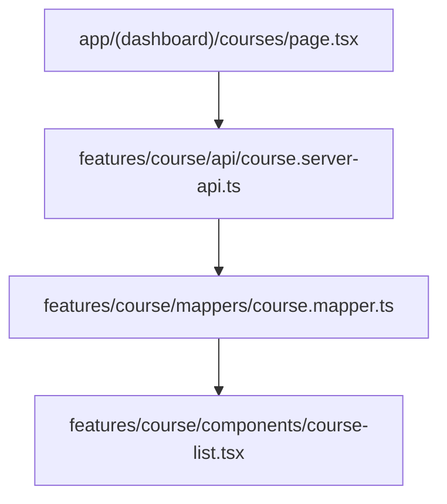
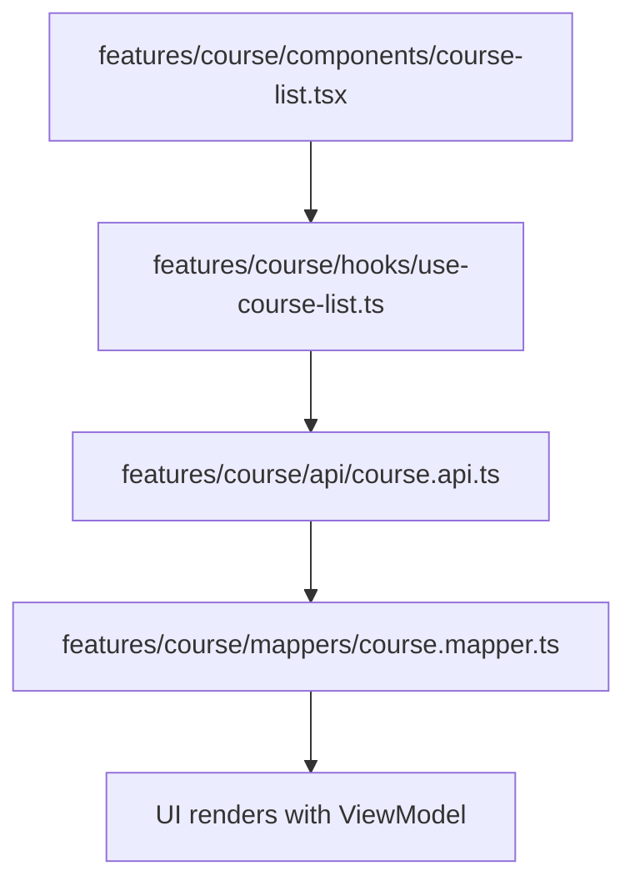
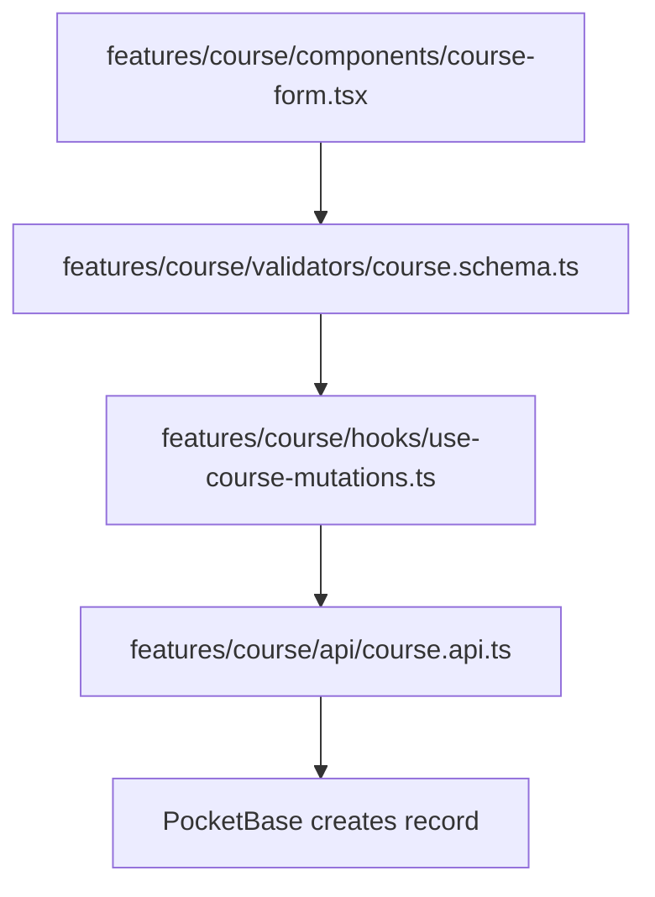

---
aliases:
  - sad
  - asd
cssclasses:
  - prety
tags:
  - architect
ddsfsdf:
f: 4564
---

# 📁 Project Architecture & Folder Structure

> Document: `docs/01-architecture.md`  
> Last updated: 2026-04-23

---

## Naming Conventions & Data Model Types

| Term         | Description                                                        | Example                                    | File Suffix      |
|--------------|--------------------------------------------------------------------|--------------------------------------------|-----------------|
| **Entity**   | Domain model with business logic and identity                      | `CourseEntity` with `isPublishable()`      | `.entity.ts`    |
| **DTO**      | Raw API response shape (never modified, just mapped)               | `CourseResponseDto` (exact JSON from API)  | `.dto.ts`       |
| **Payload**  | Data sent to API (POST/PUT body)                                   | `CreateCoursePayload`, `UpdateCoursePayload`| `.payload.ts`   |
| **Query**    | URL params for filtering/search/pagination                         | `CourseListQuery { page, search, level }`  | `.query.ts`     |
| **ViewModel**| UI-ready model, may combine entities or have computed fields       | `CourseCardViewModel { title, badgeColor }`| `.viewmodel.ts` |

**Data Flow Principle:**

> API Response (DTO) → Mapper → Entity (domain logic) → Mapper → ViewModel (UI)
> 
> UI Form → Payload → API Request

Never pass a DTO directly to the UI. Never send an Entity directly to the API.

---

## Feature Isolation & Layering

- **Feature-based isolation:** Each feature is self-contained (models, API, hooks, components, validators, store)
- **Layer-based sharing:** Shared code (infrastructure, presentation, shared) is global and not feature-specific

**What to Isolate (per feature):**

| Isolate (✅)                | Do Not Isolate (❌, put in shared)         |
|----------------------------|-------------------------------------------|
| Models (entity, dto, etc.) | HTTP client / PocketBase client           |
| API functions              | UI primitives (Button, Input, Modal)      |
| Feature-specific hooks     | Utils (cn, formatDate, regex)             |
| Feature-specific components| Constants (app-wide)                      |
| Feature-specific validators| Layout components                         |
| Store slice (if needed)    | Global stores (theme, auth, toast)        |

---

## Folder Structure

```text
src/
├── app/                # Next.js App Router (routing only)
│   └── (home)/
│
├── features/ # 🔥 Feature-based isolation
│	└── [feature A]/
│	    ├── models/         # entity, dto, payload, query, viewmodel
│	    ├── mappers/        # DTO ↔ Entity ↔ ViewModel
│	    ├── api/            # API calls (client/server)
│	    ├── hooks/          # React Query hooks
│	    ├── validators/     # Zod schemas
│	    ├── components/     # Feature-specific UI
│	    ├── store/          # Zustand slice (if needed)
│	    └── index.ts        # Public API (re-exports)
│   
├── shared/             # Cross-feature shared code
│   ├── types/
│   ├── utils/
│   ├── constants/
│   ├── validators/
│   └── hooks/
│
├── core/     # External world connections
│   ├── http/
│   ├── pocketbase/
│   └── storage/
│
├── presentation/       # Global UI layer
│   ├── components/
│   │   ├── ui/         # Primitives (Button, Input, Card, ...)
│   │   ├── layouts/    # Layouts (DashboardLayout, PublicLayout)
│   │   └── shared/     # Navbar, Sidebar, Footer, ErrorBoundary
│   ├── providers/
│   └── stores/
│
├── examples/           # Learning playground
└── docs/               # Documentation
```

---

## Data Flow Diagrams

### Server Component Data Flow



### Client Component Data Flow



### Mutation Flow



---

## Import Rules

| Allowed Imports (✅)                | Forbidden Imports (❌)                |
|-------------------------------------|--------------------------------------|
| feature → shared                    | feature → another feature            |
| feature → infrastructure            | shared → feature                     |
| feature → presentation/components/ui| infra → feature                      |
| app → feature                       |                                      |
| app → presentation                  |                                      |

If two features need to communicate, extract shared logic to `shared/` or compose them at the `app/` layer.

---

## Philosophy

This project follows a **Feature-Based + Layered** architecture:

- Each **feature** is fully isolated (models, API, hooks, components, validators)
- **Shared** code lives in dedicated layers (infrastructure, presentation, shared)
- A feature should be deletable without breaking other features

---

## Data Model Glossary

| Term        | Purpose                                         | Naming Convention         | Example                                   |
|-------------|-------------------------------------------------|---------------------------|-------------------------------------------|
| **Entity**  | Domain model with business logic and identity    | `CourseEntity`            | Has `id`, methods like `isPublishable()`   |
| **DTO**     | Raw API response shape — never modify, just map  | `CourseResponseDto`       | Exact JSON from PocketBase                |
| **Payload** | Data sent TO the API (POST/PUT body)             | `CreateCoursePayload`     | Only fields API expects                   |
| **Query**   | URL params for filtering/pagination              | `CourseListQuery`         | `{ page, search, level }`                 |
| **ViewModel**| UI-ready data — computed fields, formatted values| `CourseCardViewModel`     | `{ title, badgeColor, durationLabel }`    |

---

## When to Create a New Feature?

Ask yourself:

- Does it have its own API endpoints? → Yes → New feature
- Does it have its own data models? → Yes → New feature
- Is it just a UI variation of existing data? → No → Add to existing feature
- Is it a shared utility? → No → Put in shared

---

## Server vs Client Components

| Type              | Where                                 | How to fetch                                  |
|-------------------|---------------------------------------|-----------------------------------------------|
| Server Component  | `app/**/page.tsx`                     | `feature/api/_.server-api.ts` (direct fetch)  |
| Client Component  | `features/_/components/_.tsx`         | `feature/hooks/use-_.ts` (React Query)        |

Server components fetch data and pass it as props. Client components use hooks for interactivity and real-time updates.

---

## Feature Template

To create a new feature:
1. Copy the contents of `features/_template/`.
2. Rename all `name` placeholders to your feature name.
3. Implement your feature logic in the isolated structure.
