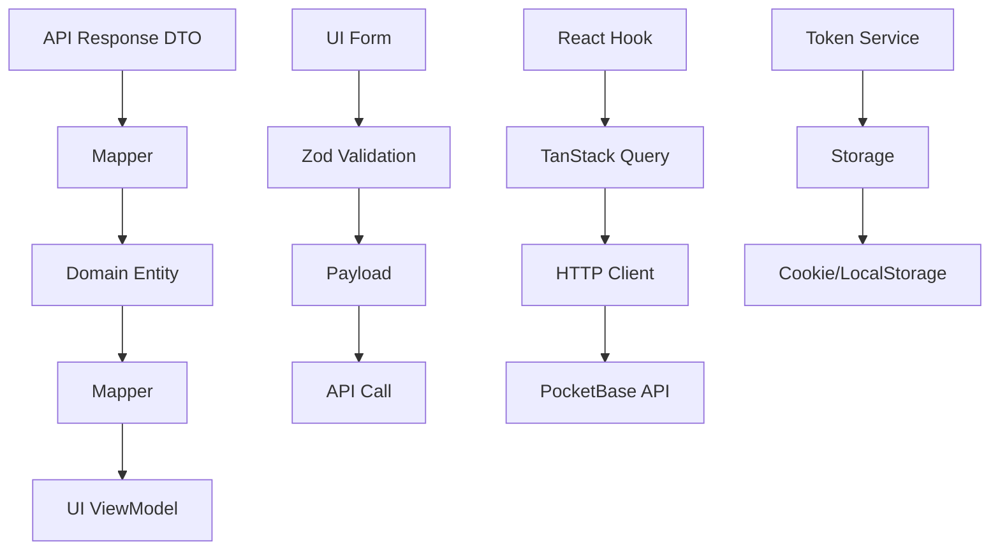

# Auth Feature Documentation

## Overview

The `auth` feature provides a complete authentication system for PocketBase, implementing signup, login, password reset, email change, and token refresh functionality. It follows the project's layered architecture with clear separation of concerns.

## Architecture & Data Flow

### Data Flow Diagram



### Layered Architecture

```
┌─────────────────┐
│   Components    │ ← React forms with validation
├─────────────────┤
│     Hooks       │ ← React Query integration
├─────────────────┤
│      API        │ ← HTTP calls to PocketBase
├─────────────────┤
│   Validators    │ ← Zod schemas
├─────────────────┤
│    Mappers      │ ← DTO ↔ Entity ↔ ViewModel
├─────────────────┤
│    Models       │ ← Type definitions
└─────────────────┘
```

## File Structure & Purpose

### Models (`models/`)

#### `auth.dto.ts` - Data Transfer Objects

Raw API response shapes from PocketBase. **Never modify these** - they represent the exact JSON structure returned by the server.

```typescript
export interface UserRecordDto {
  id: string;
  email: string;
  name: string;
  avatar: string;
  verified: boolean;
  // ... exact PocketBase fields
}
```

#### `auth.entity.ts` - Domain Entities

Business logic models with methods and identity. These represent your domain concepts.

```typescript
export interface UserEntity {
  id: string;
  email: string;
  name: string;
  verified: boolean;
  createdAt: Date; // Mapped from string
  updatedAt: Date; // Mapped from string
}
```

#### `auth.payload.ts` - Request Payloads

Data sent TO the API. Only includes fields the API expects.

```typescript
export interface SignupPayload {
  email: string;
  name: string;
  password: string;
  passwordConfirm: string;
  emailVisibility: boolean;
  avatar?: File; // For multipart uploads
}
```

#### `auth.viewmodel.ts` - UI View Models

UI-ready data with computed fields and formatting.

```typescript
export interface UserViewModel {
  id: string;
  email: string;
  displayName: string; // name || email
  avatarUrl: string | null; // Full URL or null
  isVerified: boolean;
}
```

### Mappers (`mappers/`)

#### `auth.mapper.ts` - Data Transformation

Converts between layers: DTO → Entity → ViewModel

```typescript
export class AuthMapper {
  static recordToEntity(dto: UserRecordDto): UserEntity {
    return {
      ...dto,
      createdAt: new Date(dto.created), // String → Date
      updatedAt: new Date(dto.updated),
    };
  }

  static userToViewModel(entity: UserEntity): UserViewModel {
    const avatarUrl = entity.avatar
      ? `${PB_URL}/api/files/${entity.id}/${entity.avatar}`
      : null;

    return {
      id: entity.id,
      email: entity.email,
      displayName: entity.name || entity.email,
      avatarUrl,
      isVerified: entity.verified,
    };
  }
}
```

### Validators (`validators/`)

#### `auth.schema.ts` - Zod Validation Schemas

Input validation and type safety for forms.

```typescript
export const signupSchema = z
  .object({
    email: z.string().email("Invalid email"),
    name: z.string().min(1, "Name required"),
    password: z.string().min(8, "Min 8 chars"),
    passwordConfirm: z.string(),
    emailVisibility: z.boolean(),
    avatar: z.instanceof(File).optional(),
  })
  .refine((data) => data.password === data.passwordConfirm, {
    message: "Passwords must match",
    path: ["passwordConfirm"],
  });
```

### API Layer (`api/`)

#### `auth.keys.ts` - TanStack Query Keys

Cache key definitions for React Query.

```typescript
export const authKeys = {
  all: ["auth"] as const,
  session: () => [...authKeys.all, "session"] as const,
};
```

#### `auth.api.ts` - HTTP API Calls

Direct API communication using the core HTTP client.

```typescript
export async function signup(
  payload: SignupPayload,
): Promise<SignupResponseDto> {
  if (payload.avatar) {
    // Multipart upload for files
    const formData = new FormData();
    // ... populate formData
    return await api.upload({ url: "/users/records", body: formData });
  }

  // JSON request
  return await httpClient.post("/users/records", payload);
}
```

### Hooks (`hooks/`)

React Query hooks that provide data fetching and mutations.

#### `use-signup.ts` - User Registration

```typescript
const { signup, isPending, error } = useSignup();

await signup({
  email: "user@example.com",
  name: "John Doe",
  password: "password123",
  passwordConfirm: "password123",
  emailVisibility: false,
});
```

#### `use-login.ts` - Authentication

```typescript
const { login, isPending, error } = useLogin();

await login({
  identity: "user@example.com",
  password: "password123",
});
// Stores token and redirects on success
```

#### `use-auth-refresh.ts` - Token Refresh

```typescript
const { refresh } = useAuthRefresh();
await refresh(); // Refreshes expired tokens
```

#### `use-password-reset.ts` - Password Management

```typescript
const { request, confirm } = usePasswordReset();

// Request reset email
await request({ email: "user@example.com" });

// Confirm with token
await confirm({
  token: "reset-token",
  password: "newpassword",
  passwordConfirm: "newpassword",
});
```

#### `use-email-change.ts` - Email Updates

```typescript
const { request, confirm } = useEmailChange();

// Request email change
await request({ newEmail: "new@example.com" });

// Confirm with token
await confirm({
  token: "email-change-token",
  password: "current-password",
});
```

### Components (`components/`)

#### `signup-form.tsx` - Registration Form

Complete signup form with validation, file upload, and error handling.

#### `login-form.tsx` - Login Form

Login form with forgot password flow built-in.

### Public API (`index.ts`)

Barrel export of all public interfaces.

## Implementation Guide

### 1. Setup Environment Variables

```bash
# .env.local
POCKET_BASE_URL=http://127.0.0.1:8090
NEXT_PUBLIC_API_BASE_URL=http://127.0.0.1:8090
NEXT_PUBLIC_REFRESH_ENDPOINT=/api/collections/users/auth-refresh
```

### 2. Bootstrap Core Services

```tsx
// app/layout.tsx
import { CoreProvider } from "@/presentation/providers/CoreProvider";

export default function RootLayout({ children }) {
  return (
    <html>
      <body>
        <CoreProvider>{children}</CoreProvider>
      </body>
    </html>
  );
}
```

### 3. Create Auth Pages

```tsx
// app/(auth)/signup/page.tsx
import { SignupForm } from "@/features/auth";

export default function SignupPage() {
  return (
    <main className="flex min-h-screen items-center justify-center">
      <div className="w-full max-w-md">
        <SignupForm />
      </div>
    </main>
  );
}
```

### 4. Add Navigation

```tsx
// After successful login/signup
router.push("/"); // Redirect to dashboard
```

## Usage Examples

### Complete Signup Flow

```tsx
"use client";

import { SignupForm } from "@/features/auth";

export function SignupPage() {
  return (
    <div className="min-h-screen flex items-center justify-center">
      <div className="max-w-md w-full">
        <h1 className="text-2xl font-bold mb-6">Create Account</h1>
        <SignupForm />
      </div>
    </div>
  );
}
```

### Login with Error Handling

```tsx
"use client";

import { LoginForm } from "@/features/auth";

export function LoginPage() {
  return (
    <div className="min-h-screen flex items-center justify-center">
      <div className="max-w-md w-full">
        <h1 className="text-2xl font-bold mb-6">Sign In</h1>
        <LoginForm />
      </div>
    </div>
  );
}
```

### Custom Auth Hook Usage

```tsx
"use client";

import { useLogin, useSignup } from "@/features/auth";

export function CustomAuthComponent() {
  const { login, isPending: loginPending } = useLogin();
  const { signup, isPending: signupPending } = useSignup();

  const handleLogin = async () => {
    try {
      await login({ identity: "user@example.com", password: "pass" });
      // Success - user is redirected automatically
    } catch (error) {
      // Handle error
      console.error("Login failed:", error.message);
    }
  };

  // Similar for signup...
}
```

## Best Practices

### 1. **Never Skip Validation**

Always use Zod schemas for form validation. They provide:

- Type safety
- Runtime validation
- Better error messages
- Consistent validation rules

### 2. **Handle Errors Properly**

Use the domain error types from `@/core/services/error-mapper`:

```typescript
import { isAuthenticationError, isValidationError } from "@/core";

try {
  await login(credentials);
} catch (error) {
  if (isAuthenticationError(error)) {
    // Show login error
  } else if (isValidationError(error)) {
    // Show field errors
  } else {
    // Generic error
  }
}
```

### 3. **Use React Query Keys**

Always define query keys in `auth.keys.ts` for proper cache invalidation:

```typescript
// ✅ Good
queryClient.invalidateQueries({ queryKey: authKeys.session() });

// ❌ Bad - hardcoded strings
queryClient.invalidateQueries({ queryKey: ["auth", "session"] });
```

### 4. **Keep Components Focused**

Components should only handle UI logic. Move business logic to hooks:

```typescript
// ✅ Good
export function LoginForm() {
  const { login, isPending, error } = useLogin();

  const onSubmit = (values) => login(values);

  return <form onSubmit={handleSubmit(onSubmit)}>... </form>;
}

// ❌ Bad - business logic in component
export function LoginForm() {
  const [isLoading, setIsLoading] = useState(false);

  const onSubmit = async (values) => {
    setIsLoading(true);
    try {
      await api.login(values);
      router.push('/');
    } catch (error) {
      // handle error
    } finally {
      setIsLoading(false);
    }
  };
}
```

### 5. **Type Safety First**

Always use the provided types:

```typescript
// ✅ Good
import type { SignupPayload, UserViewModel } from "@/features/auth";

// ❌ Bad - inline types or any
const user: any = await signup(data);
```

### 6. **Test Your Forms**

Test validation thoroughly:

```typescript
// Test validation
const schema = signupSchema;
expect(() => schema.parse(validData)).not.toThrow();
expect(() => schema.parse(invalidData)).toThrow();
```

### 7. **Secure Token Storage**

The system automatically handles token storage via `TokenService`. Never manually store tokens:

```typescript
// ✅ Good - handled automatically
await login(credentials); // Token stored via TokenService

// ❌ Bad - manual token handling
const response = await api.login(credentials);
localStorage.setItem("token", response.token);
```

### 8. **Avatar Upload Handling**

For file uploads, ensure proper FormData construction:

```typescript
// ✅ Good - handled in auth.api.ts
const formData = new FormData();
formData.append("avatar", file);
await api.upload({ url: "/users/records", body: formData });
```

### 9. **Error Boundaries**

Wrap auth forms in error boundaries for better UX:

```tsx
import { ErrorBoundary } from "react-error-boundary";

export function AuthPage() {
  return (
    <ErrorBoundary fallback={<div>Something went wrong</div>}>
      <LoginForm />
    </ErrorBoundary>
  );
}
```

### 10. **Accessibility**

Ensure forms are accessible:

```tsx
// ✅ Good
<label htmlFor="email">Email</label>
<input id="email" type="email" aria-describedby="email-error" />

{errors.email && (
  <p id="email-error" role="alert">
    {errors.email.message}
  </p>
)}
```

This auth feature provides a solid foundation for user authentication while maintaining clean architecture and type safety. Follow these patterns to build maintainable, scalable authentication systems.
